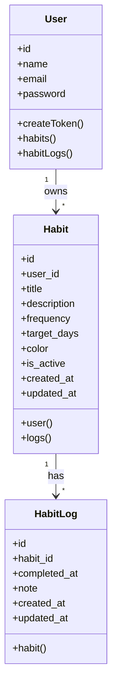
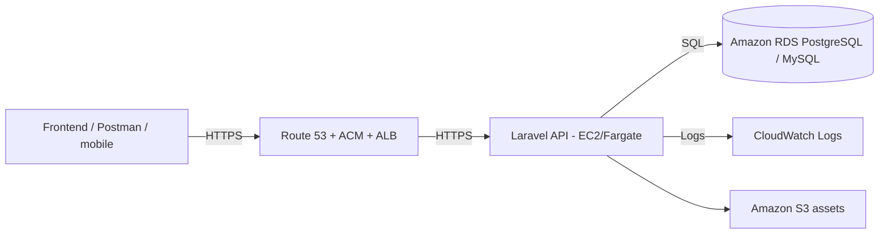

# Habits Tracker API — Conception technique

## Diagramme de cas d'utilisation
```mermaid
flowchart TD
    Actor((Utilisateur))
    subgraph Authentification
      A[POST /api/register]
      B[POST /api/login]
      C[POST /api/logout]
      D[GET /api/me]
    end
    subgraph Habitudes
      E[GET /api/habits]
      F[POST /api/habits]
      G[GET /api/habits/{id}]
      H[PUT /api/habits/{id}]
      I[DELETE /api/habits/{id}]
    end
    subgraph Suivi
      J[POST /api/habits/{id}/logs]
      K[GET /api/habits/{id}/logs]
      L[DELETE /api/habits/{id}/logs/{logId}]
      M[GET /api/habits/{id}/stats]
      N[GET /api/stats/overview]
    end

    Utilisateur --> A
    Utilisateur --> B
    Utilisateur --> C
    Utilisateur --> D
    Utilisateur --> E
    Utilisateur --> F
    Utilisateur --> G
    Utilisateur --> H
    Utilisateur --> I
    Utilisateur --> J
    Utilisateur --> K
    Utilisateur --> L
    Utilisateur --> M
    Utilisateur --> N
```

## Diagramme de classes (backend)


## Architecture cible de déploiement AWS

- API Laravel (PHP-FPM) dans ECS Fargate ou EC2 Auto Scaling Group.
- Base PostgreSQL RDS en subnet privée.
- NGINX/Apache ALB en front.
- S3 + CloudFront pour assets publics.
- CloudWatch + SNS pour logs et alertes.
- Parameter Store + Secrets Manager pour `APP_KEY`, DB creds, Sanctum.
- Route 53 + ACM pour HTTPS.

### Schéma (vue logique)

